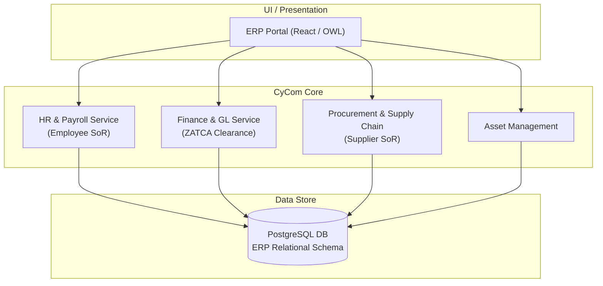

# CyCom Reference Architecture & Competitive Analysis

## 1. System Overview

`CyCom` is CyberCom's enterprise resource planning (ERP) platform. It provides General Ledger (GL) accounting, human resource management (HR/Payroll), procurement, fixed assets, and inventory tracking.

---

## 2. Competitive Landscape & Comparison

This section evaluates `CyCom` against major global and modular ERP systems:

| Feature / Domain | CyCom | Odoo | SAP S/4HANA | Oracle ERP Cloud | Microsoft Dynamics 365 |
|---|---|---|---|---|---|
| **Architecture** | Modern microservices. | Monolithic Python backend with PostgreSQL. | Heavy in-memory (HANA) enterprise monolith. | Large enterprise cloud monolith. | Hybrid cloud/monolithic architecture. |
| **Customization** | GitOps-driven micro-layouts. | Python-based OWL and server actions. | Complex ABAP development. | Proprietary Oracle toolsets. | C# / AL development. |
| **Middle East Localization**| Native ZATCA Phase 2, UAE VAT, Jordan tax. | Third-party localizations of varying quality. | High (but complex and expensive to configure). | High (but complex configuration). | High (but complex configuration). |
| **Healthcare Integration**| Direct Kafka events to clinical `CyMed`. | Handled via custom external middleware. | Heavy SAP PI/PO middleware required. | Complex integrations. | Requires Azure Health Data Services. |
| **Cost / License** | Subscription SaaS (Value pricing). | Low/Medium (Open source / Enterprise). | High (Enterprise licensing + consulting). | High (Enterprise licensing). | High (Per-user subscription). |

---

## 3. Capability Gaps & Future Roadmap

As a young ERP platform, `CyCom` has specific capability gaps compared to decades-old systems:

### 3.1 Gaps Identified
*   **Advanced Treasury & Multi-Currency Hedging:** SAP and Oracle ERP have robust financial forecasting and foreign-exchange hedging engines. `CyCom` has basic multi-currency ledger support.
*   **Deep Production Manufacturing (MRP II):** Systems like SAP or Odoo have comprehensive manufacturing routers, bills of materials (BOM), and factory floor execution. `CyCom` focuses primarily on hospital service procurement and general retail logistics, lacking heavy discrete manufacturing controls.

### 3.2 Roadmap Items
1.  **Phase 1.5:** Release a treasury forecasting module for multi-entity cash pool consolidation.
2.  **Phase 1.6:** Integrate a manufacturing routing engine for medical production lines.
3.  **Phase 1.7:** Standardize automated bank reconciliation APIs for major Middle Eastern banks (e.g., Al Rajhi, SABB, ADIB).

---

## 4. Key Architectural Subsystems

### 4.1 Segregation of Duties (SoD)
`CyCom` implements rigid RBAC models to enforce Segregation of Duties:
*   A user who creates a purchase order cannot approve it.
*   A user who registers a supplier cannot approve invoice payments to that supplier.
*   All financial approvals require two-factor authentication (MFA/passkey validation).

### 4.2 Financial Ledger Immutability
All General Ledger postings are append-only. To correct an entry, a balancing reversing transaction must be posted. The database schema forbids direct `UPDATE` or `DELETE` commands on the ledger tables.

---

## 5. Revision History

| Date | Version | Description | Author |
|---|---|---|---|
| 2026-06-21 | 1.0 | Initial CyCom Reference Architecture | Enterprise Architect |
