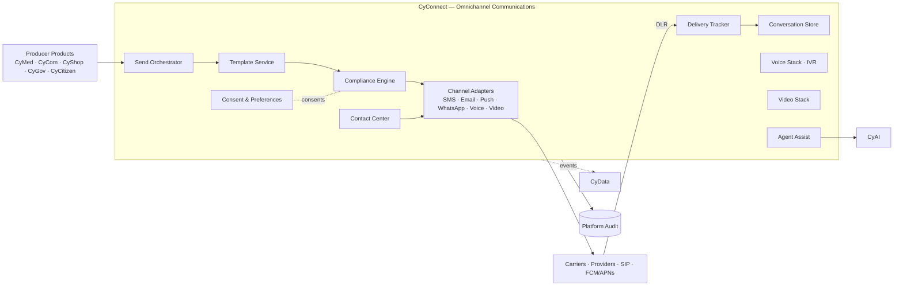

# CyConnect — Product Architecture (Omnichannel Communications)

> **Status:** Approved — established by [ADR-0019](../adr/ADR-0019-cyconnect-communications-platform.md) (2026-06-21)
> **Replaces:** the communications scope previously documented under `cycom_architecture.md` (Phase 1.1)
> **Owner:** Platform Architect (Communications)

---

## 1. Mission

**Be CyberCom's omnichannel communications platform** — the one product every other product uses to *talk* to humans (in-app messaging, email, SMS, WhatsApp, push, voice, video) and to operate contact centers — with consistent identity, audit, consent, and compliance.

## 2. Scope

**In scope**
- **Messaging:** in-app chat, secure clinician/agent chat, internal collaboration threads.
- **Email:** transactional + bulk email (templates, deliverability, suppression).
- **SMS:** SMS / MMS / RCS via carriers and aggregators.
- **WhatsApp:** WhatsApp Business and similar over-the-top channels per partner agreement.
- **Voice:** SIP trunking, IVR, click-to-call, recording (consent-aware), TTS/STT.
- **Video:** real-time video calls, telehealth, webinars (media-server abstraction).
- **Contact Center:** queues, skills routing, agent desktop, supervisor tools, omnichannel handoff.
- **Notifications:** push (FCM/APNs), in-app banners, jurisdiction-aware delivery rules.
- **Omnichannel Communications:** conversation graph across channels per recipient; threading and continuity.

**Out of scope (delegated)**
- Identity & sign-in → **CyIdentity**.
- Authoring of clinical / financial / civic / commerce content → the producing product (**CyMed / CyCom / CyGov / CyShop**).
- ERP approval workflows → **CyCom Approvals** (CyConnect MAY deliver the notification; the workflow lives in CyCom).
- Payments for premium SMS / international voice → **CyShop** captures; **CyCom Finance** recognizes AR.
- Cross-product engagement analytics → **CyData**.
- AI agent-assist **models** → **CyAI**. CyConnect embeds; CyAI infers.
- Partner / carrier API onboarding at platform scale → **CyIntegration Hub** (CyConnect operates the runtime channel adapters).

## 3. Users

| User class | Examples |
|---|---|
| Producer products | CyMed (appointment reminders, telehealth), CyShop (order updates, receipts), CyCom (approval notifications, payslip published), CyGov / CyCitizen (notices) |
| End-recipients | Patients, customers, citizens, employees |
| Agents | Contact-center agents, supervisors |
| Workforce | Internal collab, secure clinician chat |

## 4. Core Modules

1. **Channel Adapters** — SMS/MMS/RCS, email (SMTP + transactional providers), push (FCM/APNs), WhatsApp/iMessage, voice (SIP), video.
2. **Template Service** — versioned, locale-aware templates with placeholders + regulatory headers.
3. **Send Orchestrator** — channel fallback, retries, rate limits, cost-aware routing.
4. **Consent & Preferences** — central opt-in/out, channel preferences, quiet hours, do-not-contact (jurisdiction-aware).
5. **Delivery Tracker** — receipts, DLR, bounces, link-click events (consent-gated).
6. **Conversation Store** — durable threads per recipient + per producing product.
7. **Voice Stack** — IVR designer, SIP trunking abstraction, call recording (consent-aware), TTS/STT.
8. **Video Stack** — media server abstraction (LiveKit / Janus / vendor); recording (consent-aware).
9. **Contact Center** — queues, skills routing, agent desktop, omnichannel state, supervisor.
10. **Agent Assist (embedding)** — embeds **CyAI** suggestions (summaries, replies, next-best-action) without owning the model.
11. **Compliance Engine** — TCPA / CASL / GDPR / ePrivacy / HIPAA-aware suppression and gating; non-bypassable.

## 5. Shared Services Consumed

| Service | Use |
|---|---|
| CyIdentity | All human authN; consent capture context |
| CyIntegration Hub | Carrier / provider connections; partner ingress; webhook lifecycle |
| CyData | Analytics on delivery, engagement, cost |
| CyAI | Agent assist, summarization, sentiment |
| CyShop | Billing capture for premium / international traffic |
| CyCom Finance | AR recognition for CyConnect-billed traffic (via CyShop capture path) |
| Platform audit / observability / secrets | Standard |

## 6. Owned Data

- Channel adapter configs; provider credentials (in Vault).
- Templates and template versions.
- Recipient preferences and consent state (per jurisdiction).
- Conversation threads, message bodies (encrypted at rest; field-level for highest classes).
- Delivery attempts, receipts, DLRs.
- Voice call metadata; recordings (encrypted; retention-bounded).
- Video session metadata; recordings (encrypted; retention-bounded).
- Contact-center queues, routing rules, agent presence, supervisor metrics.

## 7. Consumed Data

- Recipient identity claims from **CyIdentity** (canonical contact info preferred from there).
- Source-of-record content from producing products (CyMed care messages, CyShop order updates, CyCom approval requests, CyGov notices).
- AI suggestions from **CyAI** for agent assist.

## 8. APIs

- **Send API** (`/v1/messages`, `/v1/calls`, `/v1/videos`) — channel-agnostic with hints.
- **Template API** — CRUD templates, render previews, version management.
- **Preferences API** — read / update recipient preferences and consents.
- **Conversation API** — list / read / search threads (scoped to producing product + recipient).
- **Contact-center APIs** — queues, agent state, omnichannel handoff.
- **Webhook ingress** — provider DLR / receipt webhooks (signed).

## 9. Events

Produced (prefix `cybercom.cyconnect.*` — **replaces** the previously-planned `cybercom.cycom.*` for comms):

- `message.queued`, `message.sent`, `message.delivered`, `message.failed`, `message.bounced`
- `call.started`, `call.ended`, `call.recorded`
- `video.session.started`, `video.session.ended`
- `consent.granted`, `consent.withdrawn`
- `conversation.created`, `conversation.archived`
- `cc.agent.available`, `cc.agent.unavailable`, `cc.handoff`

Consumed:

- `cybercom.cymed.appointment.scheduled` → trigger reminder.
- `cybercom.cyshop.order.shipped` → trigger order update.
- `cybercom.cycom.approval.requested` → trigger approval notification.
- `cybercom.cycom.payslip.published` → trigger employee notification.
- `cybercom.cygov.case.updated` → trigger civic notice.
- `cybercom.cyidentity.session.created` → optional security notification.

## 10. Integrations

- **Carriers / providers:** Twilio, Vonage, MessageBird, regional carriers; email (SES, SendGrid, native); push (FCM/APNs).
- **SIP trunks** per jurisdiction.
- **Media servers** for video (LiveKit / Janus / vendor).
- **Compliance lists** (national DNC registries) per jurisdiction.

## 11. Deployment Model

- Tier-1 service; multi-AZ default; multi-region for SaaS production.
- Voice/video media plane separated from control plane; auto-scaled per session load.
- Per-tenant rate limits and cost guardrails.
- Sovereign on-prem profiles use locally licensed SIP / SMS partners (per addendum).

## 12. Security Requirements

- All content encrypted in transit (TLS 1.3) and at rest (AES-256).
- Conversation bodies treated as Confidential by default; **Restricted (PHI/PII) when the recipient relationship is clinical / governmental / financial**.
- Recording requires **explicit consent**; jurisdiction-aware notice messages.
- Webhook signatures HMAC-SHA-256 with rotating secrets + replay protection (timestamp + nonce).
- Compliance Engine blocks sends that would violate TCPA / CASL / GDPR / ePrivacy / HIPAA suppression rules — non-bypassable.
- Phishing-resistant suppression: outbound links HMAC-tokenized; click-tracking disabled by default for clinical and government messages.
- Audit every send, delivery, and recording start/stop.

## 13. Component Diagram

