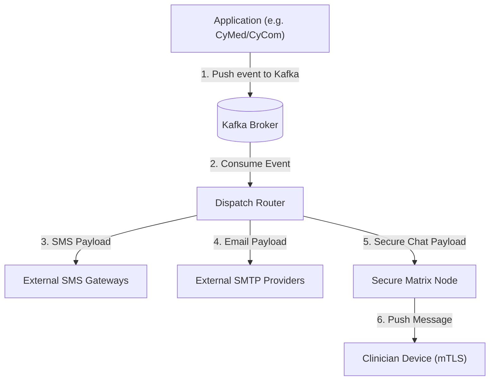

# CyConnect Reference Architecture

## 1. System Overview

`CyConnect` is CyberCom's central communication and notification platform. It manages SMS gateways, email templates, push notifications, and HIPAA-compliant secure messaging for clinical teams.

---

## 2. Core Modules

1.  **Notification Dispatcher:** Asynchronously consumes events and routes them to SMS (Twilio, Infobip, local telcos), Email (SendGrid, SES), or Push notification channels.
2.  **Template Engine:** Evaluates dynamic templates (using Handlebars/Liquid) with full localization support (English/Arabic).
3.  **Secure Clinician Chat:** Built on top of the decentralized **Matrix** protocol, providing end-to-end encrypted (E2EE) messaging for clinical teams.

---

## 3. Security and HIPAA Compliance

*   **No PHI in SMS/Email:** Standard outbound SMS and emails must never contain patient clinical data (PHI). Instead, they send secure login links (OTP-gated) directing the user back to the secure Patient Portal.
*   **Encrypted Local Database:** Clinician mobile chat client databases (e.g., Matrix client databases on iOS/Android) use SQLCipher with keys generated inside the device secure enclave.

---

## 4. Revision History

| Date | Version | Description | Author |
|---|---|---|---|
| 2026-06-21 | 1.0 | Initial CyConnect Reference Architecture | Enterprise Architect |
