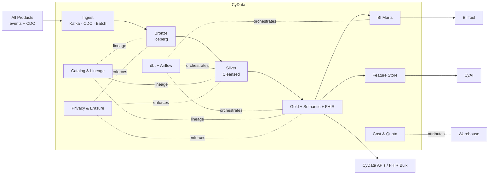

# CyData — Product Architecture

> **Status:** Approved — Program 1, Phase 1.1
> **Owner:** Principal Engineer (Data)
> **Related:** [ADR-0015](../adr/ADR-0015-reporting-analytics-strategy.md), [ADR-0014](../adr/ADR-0014-database-scaling-strategy.md)

---

## 1. Mission

**Be CyberCom's data plane** — the place where every product's data converges, is conformed and governed, and is served to BI, ML, regulatory reporting, and product analytics — without ever touching OLTP primaries.

## 2. Scope

**In scope**
- Ingest (events + CDC + batch) from every product into the lakehouse.
- Medallion layering (Bronze / Silver / Gold / Marts).
- Transformations (dbt) and orchestration (Airflow).
- Catalog, classification, lineage (OpenLineage + metadata catalog).
- Feature Store (offline + online) for CyAI consumption.
- BI marts per consumer use case (Finance, Clinical Ops, Public Health, RCM, …).
- FHIR-aware semantic layer for healthcare analytics.
- Per-tenant cost attribution and quota enforcement.
- Erasure & consent propagation into the lakehouse.

**Out of scope**
- Operational reads inside a product (use the product's own DB or read replica).
- Embedded dashboards in product UIs (CyData supplies APIs / aggregated marts; products render).
- Source-of-record storage for any business entity (always lives in its owning product).
- Model serving (that is **CyAI**).

## 3. Users

| User class | Examples |
|---|---|
| Data engineers | Pipeline owners, mart curators |
| Analysts | Finance, clinical ops, public health, executive |
| Data scientists / ML engineers | CyAI feature production, model training |
| Compliance / audit | Lineage, classification, retention evidence |
| Products (programmatic) | Embedded read APIs, CyData APIs |

## 4. Core Modules

1. **Ingest Layer** — Kafka consumers, Debezium CDC, batch loaders; lands into Bronze.
2. **Lakehouse Storage** — Apache Iceberg on S3-compatible object storage; per-region pinning.
3. **Compute** — Trino + Spark + DuckDB; warehouse engine for serving (per deployment addendum).
4. **Transformation (dbt)** — models, tests, docs co-located.
5. **Orchestration (Airflow)** — idempotent DAGs; lineage emission.
6. **Catalog & Lineage** — OpenLineage + DataHub/OpenMetadata.
7. **Feature Store (Feast)** — offline materialization + online serving for CyAI.
8. **Semantic Layer** — canonical entities + FHIR-aware healthcare projections.
9. **BI Marts** — consumer-specific Gold views.
10. **Privacy & Erasure** — classification, de-identification pipelines, erasure propagation, retention enforcement.
11. **Cost & Quota** — per-tenant + per-feature cost attribution; byte-scan guardrails.

## 5. Shared Services Consumed

| Service | Use |
|---|---|
| CyIdentity | AuthN to warehouse / BI / notebooks; AuthZ via policy engine |
| CyIntegration Hub | Subscribed to every product event topic; CDC streams routed through Kafka |
| Platform secrets/KMS | Storage encryption, BYOK per tenant |
| Platform audit log | All analytics reads of PHI/PII; pipeline runs; data-contract changes |
| Platform observability | DAG metrics, lineage emissions, freshness SLOs |
| CyAI | Consumes Feature Store and Gold layer |

## 6. Owned Data

- Bronze / Silver / Gold tables + mart views (per-tenant rows).
- Catalog metadata: datasets, owners, classifications, descriptions.
- Lineage graph (OpenLineage events).
- Data contracts (per producer ↔ Bronze).
- dbt model code + tests; Airflow DAG definitions (in GitOps repo).
- Feature definitions and materialized features.
- Erasure tombstones / re-materialization records.
- Per-tenant cost and usage metrics.

## 7. Consumed Data

- Domain events from **every product** (`cybercom.<product>.*`).
- CDC streams (Debezium) from product OLTP DBs (temporary path; outbox preferred).
- Reference data: ICD-11, SNOMED, LOINC, ISO countries, currencies, gov code lists.
- HRIS data (for workforce analytics) — minimal-necessary.

## 8. APIs

- **CyData APIs** for programmatic Gold-layer reads (OpenAPI 3.1; tenant-scoped).
- **FHIR Bulk Data ($export)** for analytical export aligned with [ADR-0007](../adr/ADR-0007-healthcare-interoperability-strategy.md).
- **Feature Store API** (offline + online) for CyAI.
- **Catalog / Lineage API** for compliance evidence retrieval.
- **Admin API** for dataset registration, classification edits, contract publishing.

## 9. Events

Produced (prefix `cybercom.cydata.*`):

- `dataset.contract.published`, `dataset.contract.deprecated`
- `mart.refreshed`
- `dataset.quality.failed` (alerts)
- `erasure.applied`
- `cost.budget.exceeded`

Consumed:

- All product events (subscribed by Bronze loaders).
- Erasure signals from CyIdentity / control plane.

## 10. Integrations

- All product event streams via Kafka.
- BI tool standardization per deployment (Superset / Metabase / Looker / Power BI).
- CyAI Feature Store.
- Regulatory reporting export endpoints (per jurisdiction).

## 11. Deployment Model

- Tier-1 (storage & catalog) / Tier-2 (compute) operability.
- Lakehouse storage in object storage per region.
- Compute (Trino/Spark) cluster per region, auto-scaled.
- Warehouse engine per deployment (managed SaaS / OSS on-prem).
- Per-tenant cost separation in the warehouse layer.

## 12. Security Requirements

- All access via SSO (CyIdentity) + policy engine; per-dataset RBAC + RLS.
- Classification carried Bronze → Silver/Gold; minimum-necessary at consumer marts.
- De-identification (HIPAA Safe Harbor / Expert Determination) before any cross-tenant aggregate.
- Erasure propagation with audit attestation; no PHI lingers past retention in Bronze.
- Residency: storage region-pinned per tenant; cross-region transfer disabled by default.
- Byte-scan guardrails to prevent cost-DoS and over-broad reads.

## 13. Component Diagram

