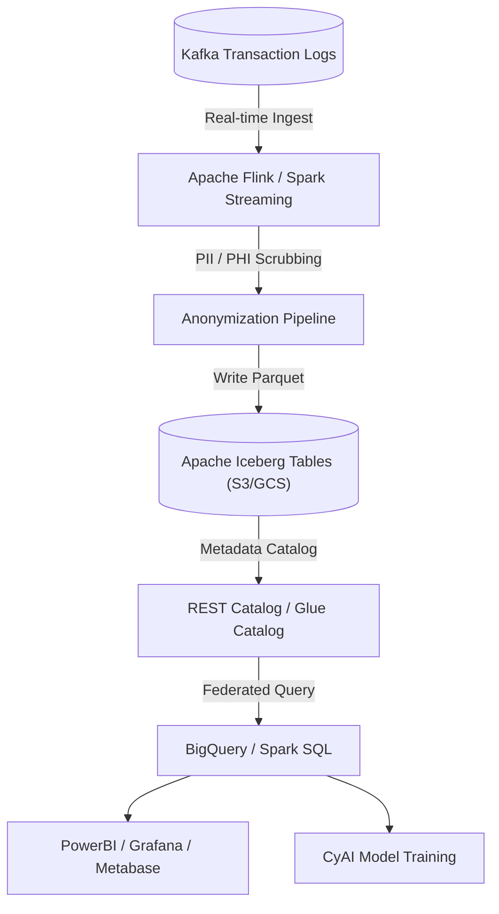

# CyData Reference Architecture

## 1. System Overview

`CyData` is CyberCom's central data warehousing and analytical platform. It ingests transactional event streams from Kafka, processes them through Spark-based pipelines, and constructs a high-performance Lakehouse (Apache Iceberg) queried via BigQuery or Snowflake.

---

## 2. Lakehouse Architecture (Apache Iceberg)

To combine the ACID reliability of SQL databases with the massive scale of object storage, `CyData` mandates **Apache Iceberg** as the table format:
*   **Table Formats:** Structured Parquet files on object storage (AWS S3, Google Cloud Storage, or MinIO).
*   **ACID Compliance:** Support for time-travel queries, schema evolution (adding/deleting columns without table rewrite), and partition pruning.
*   **Catalog Service:** Unified REST catalog or Hive/Glue Catalog managing table version locks.

---

## 3. Data Ingestion & Anonymization Engine

To maintain compliance with healthcare (HIPAA) and regional privacy laws (GDPR, KSA PDPL):
1.  **Ingestion:** Real-time data extraction is handled via Debezium CDC and Kafka Connect directly into Apache Spark or Flink.
2.  **PII/PHI Gate:** Raw tables are stored in highly-restricted, tenant-specific staging areas.
3.  **Pseudonymization:** An automated pipeline replaces direct identifiers (e.g., patient names, citizen national IDs, exact birthdates) with cryptographic hashes (`salt` + ID) and bins ages into ranges before writing to the shared analytical Iceberg tables.

---

## 4. Analytical Processing & Serving Layer

*   **Serving Layer:** BigQuery (for Cloud SaaS) or Spark SQL/Trino (for on-prem/sovereign deployments).
*   **Data Models:** dbt (data build tool) orchestrates transformations into Star and Snowflake schemas (Dimensions and Facts) for fast BI dashboard rendering and analytical reporting.

---

## 5. Revision History

| Date | Version | Description | Author |
|---|---|---|---|
| 2026-06-21 | 1.0 | Initial CyData Reference Architecture | Enterprise Architect |
