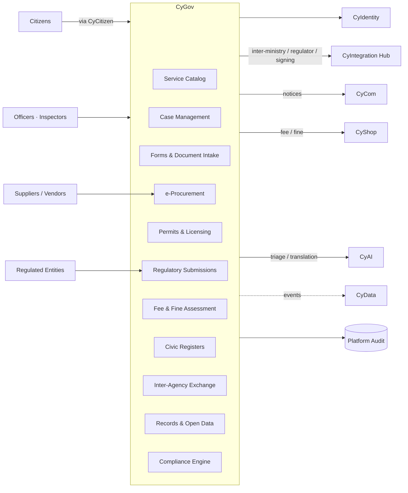

# CyGov — Product Architecture

> **Status:** Approved — Program 1, Phase 1.1
> **Owner:** Platform Architect (Government)

---

## 1. Mission

**Be CyberCom's digital government platform** — the back-of-house and partner-facing system that lets a government deliver licensed, regulated, and procurement services digitally, with the citizen face delivered by **CyCitizen**.

## 2. Scope

**In scope**
- **Service catalog & case management** for government services (licensing, permits, registrations, applications, grievances).
- **e-Procurement:** tendering, RFx, vendor management, bid evaluation, contract award, contract lifecycle.
- **Regulatory submissions:** inbound submissions from regulated entities (hospitals, businesses, banks) and outbound regulator reports.
- **Permits & licensing:** issuance, renewal, suspension, revocation, registers.
- **Fee & fine assessment:** assessment + state-of-account (payment **execution** via CyShop).
- **Civic registers:** vital records (births, deaths, marriages), business registers, property registers — where the government has chosen CyGov as system of record.
- **Inter-agency workflows:** inbound/outbound document exchange between ministries / agencies.
- **Public-records / open-data publication** (with redaction).
- **Accessibility & jurisdiction-aware UX standards** for citizen-facing surfaces (delivered by CyCitizen).

**Out of scope**
- Citizen-facing portal UX → **CyCitizen** (CyGov powers it via APIs).
- Identity & sign-in (incl. national eID federation) → **CyIdentity**.
- Payments / fee capture / receipts → **CyShop**.
- Citizen notifications / IVR → **CyCom**.
- Government **healthcare** functions (hospitals, public-health reporting) → **CyMed** + CyIntegration Hub.
- Cross-product analytics / public dashboards → **CyData**.
- AI assistance (case triage, language translation) → **CyAI**.

## 3. Users

| User class | Examples |
|---|---|
| Government officers | Case officers, licensing officers, procurement officers, inspectors |
| Regulators | Sectoral regulators (financial, health, telecom, education) |
| Regulated entities | Hospitals, banks, businesses, NGOs (submitting under regulation) |
| Suppliers / vendors | Bidders in e-procurement |
| Citizens (programmatic only) | Through **CyCitizen** front-end; CyGov rarely renders to citizens directly |
| Inter-agency partners | Other ministries / agencies |

## 4. Core Modules

1. **Service Catalog** — registry of services (with eligibility, SLAs, fees, required documents).
2. **Case Management** — workflow engine for applications; assignment, SLAs, escalation, decisions.
3. **Forms & Document Intake** — versioned form schemas, document upload + verification, multi-language.
4. **e-Procurement Suite** — RFx authoring, bid receipt, evaluation, award, contract lifecycle.
5. **Permits & Licensing** — issuance, renewal, suspension, revocation, public register projections.
6. **Regulatory Submissions** — inbound submissions + validations; outbound regulator transmissions via Hub.
7. **Fee & Fine Assessment** — assessment, statements, integration with CyShop for capture.
8. **Civic Registers** — vital records / business / property registers (jurisdiction-scoped, append-history).
9. **Inter-Agency Exchange** — secure document/case exchange, signed and audited.
10. **Records & Open Data** — public-records publication with redaction rules.
11. **Compliance Engine** — jurisdictional rules (eligibility, suppression, retention).
12. **Audit Pack** — civic-action auditing on top of platform audit.

## 5. Shared Services Consumed

| Service | Use |
|---|---|
| CyIdentity | Officer sign-in; citizen identity (via CyCitizen); partner / vendor identity; eID federation |
| CyIntegration Hub | Inter-ministry exchanges, regulator transmissions, banking (fee statements), notary / signing services |
| CyData | Service performance, SLA dashboards, open-data publication, public statistics |
| CyAI | Case triage, language translation, summarization (with appropriate AI Act risk classification) |
| CyCom | Citizen notices, officer messaging, contact center for support |
| CyShop | Fee / fine capture (citizen pays → CyShop → reconciliation back to CyGov) |
| Platform audit / observability / secrets | Standard |

## 6. Owned Data

- Service catalog definitions (versioned).
- Cases / applications (with state, history, assignments, documents).
- Permits, licenses, registrations (with state and history).
- Procurement: RFx, bids, evaluations, awards, contracts.
- Regulatory submissions and decisions.
- Fee / fine assessments and statements (the *bill*; payment execution lives in CyShop).
- Civic registers (where CyGov is SoR for that jurisdiction).
- Officer roles, queues, workload.
- Inter-agency exchange records (signed envelopes, attestations).
- Open-data publications and redaction history.

## 7. Consumed Data

- Citizen identity claims and consents from **CyIdentity** (`citizen-<jurisdiction>` realm) via **CyCitizen**.
- Vendor / business identity from CyIdentity (`partner` realm) + national business register where applicable.
- Payment events from **CyShop** (`payment.captured`, `payment.refunded`) for reconciliation.
- AI inference results from **CyAI** (decision support; never decision-making).
- Reference data: ISIC, NACE, national classification systems; geographic codes.

## 8. APIs

- **Service Catalog API** — list / lookup services, eligibility, fees, required documents.
- **Case API** — create / read / update / list cases (used heavily by CyCitizen).
- **Procurement APIs** — RFx, bid submission, contract lifecycle.
- **Permit / License APIs** — issuance, lookup, status, public register read.
- **Regulatory Submission APIs** — inbound from regulated entities; outbound to regulators via Hub.
- **Civic Register APIs** — record lookups (subject to access policy).
- **Open Data API** — published, redacted datasets (often via CyData where bulk).
- **Officer / Admin APIs** — workflows, queues, assignment, reporting.

## 9. Events

Produced (prefix `cybercom.cygov.*`):

- `case.created`, `case.assigned`, `case.decision.issued`, `case.appealed`
- `permit.issued`, `permit.renewed`, `permit.suspended`, `permit.revoked`
- `procurement.rfx.published`, `procurement.bid.received`, `procurement.contract.awarded`, `procurement.contract.signed`
- `submission.received`, `submission.validated`, `submission.rejected`
- `fee.assessed`, `fine.assessed`
- `civic.record.created`, `civic.record.amended` (with strict access control)
- `interagency.exchange.sent`, `interagency.exchange.received`

Consumed:

- `cybercom.cyidentity.account.*` (citizen / officer / vendor lifecycle).
- `cybercom.cyshop.payment.captured` / `refunded` (for fee/fine reconciliation).
- `cybercom.cymed.publichealth.notifiable.reported` (for cross-product public-health workflows where applicable).
- Inbound regulator messages projected as `cybercom.hub.gov.*` events.

## 10. Integrations

- **National eID** (via CyIdentity).
- **Banking & ePayments** for fee statements / reconciliation (via Hub, with CyShop as the capture surface).
- **Notary / digital-signature** providers per jurisdiction.
- **Inter-ministry exchanges** (often jurisdiction-specific protocols).
- **National classification systems** (ISIC, NACE, business registers).
- **Geo / cadastre** services (for permits, property registers).
- **Regulator portals** (outbound transmissions).

## 11. Deployment Model

- Tier-1 for case management, registers, and procurement; Tier-2 for catalog and open data.
- **Sovereign on-prem and national-cloud** profiles are the norm for many CyGov tenants (per [ADR-0008](../adr/ADR-0008-saas-deployment-strategy.md)).
- Per-jurisdiction CMK (BYOK) common; data residency strictly enforced.
- Per-jurisdiction connector packs maintained centrally.
- DR: cross-region within jurisdiction; air-gap option for sovereign installs.

## 12. Security Requirements

- All officer actions audited with case context and purpose-of-use.
- Civic-register changes are append-only with cryptographic attestation; corrections via "supersede" record (no in-place edits).
- Citizen data minimization: CyGov stores only what the service requires; common identity attributes live in CyIdentity.
- Jurisdictional accessibility standards (WCAG 2.2 AA baseline; AAA where mandated) applied to anything CyCitizen renders from CyGov.
- Procurement evaluation immutably recorded; conflict-of-interest checks; sealed-bid timing controls.
- Regulator transmissions signed (digital signatures); receipt confirmations stored.
- Open-data publications go through a documented redaction pipeline; PII never published.
- Per-jurisdiction retention policies enforced; legal hold supported.
- AI Act risk classification recorded for any CyAI feature used in case decisions; **AI does not make legal decisions** (human-in-the-loop mandatory).

## 13. Component Diagram

