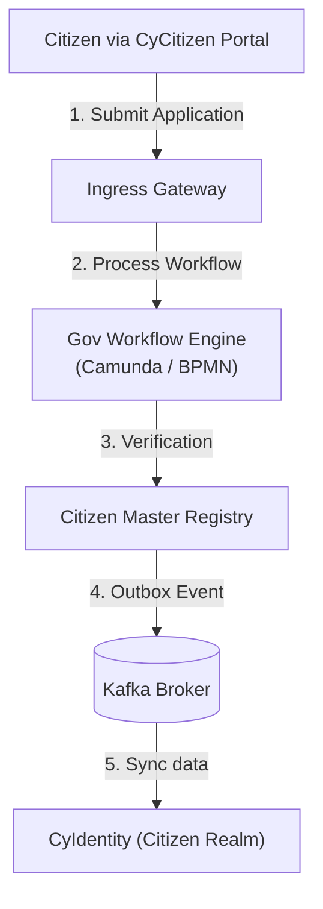

# CyGov Reference Architecture

## 1. System Overview

`CyGov` is CyberCom's public-sector and municipal services platform. It manages the Citizen Master registry, land and property databases, municipal business licensing, and civic permits.

---

## 2. Core Modules

1.  **Citizen Registry:** The writing System of Record for all citizens.
2.  **Land & Property Registry:** Digital ledger tracking property deeds, ownership transfers, and valuations.
3.  **Permit & Licensing Engine:** BPMN-driven workflow module processing permits (construction, municipal approvals, environmental licenses).
4.  **Taxation Service:** Integrates with local income tax portals and customs systems.

---

## 3. Data Residency and Isolation

To meet national security mandates:
*   **Complete Isolation:** Citizen records are hosted in dedicated, regional government clouds (e.g., AWS GovCloud, local government data centers) with strict data sovereignty boundaries.
*   **Access Audit:** All reads and writes to the Citizen Registry must be signed with the operator's digital signature card and logged to the WORM audit sink.

---

## 4. Revision History

| Date | Version | Description | Author |
|---|---|---|---|
| 2026-06-21 | 1.0 | Initial CyGov Reference Architecture | Enterprise Architect |
