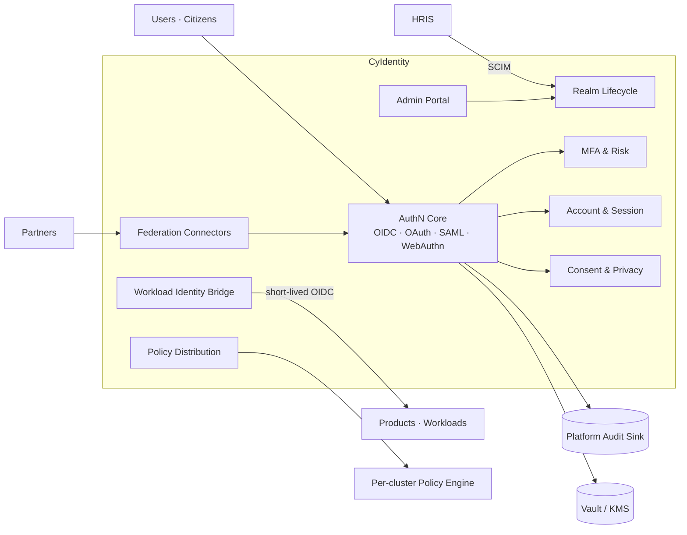

# CyIdentity — Product Architecture

> **Status:** Approved — Program 1, Phase 1.1
> **Owner:** Chief Security Architect
> **Related:** [ADR-0005](../adr/ADR-0005-identity-access-management-strategy.md), [ADR-0017](../adr/ADR-0017-cyidentity-product-strategy.md), [`identity_access_strategy`](../security/identity_access_strategy.md)

---

## 1. Mission

**Be the single, standards-based identity provider for every human, citizen, partner, and workload in the CyberCom platform** — with strong authentication, fine-grained authorization, and full auditability across SaaS, private cloud, and sovereign on-prem.

## 2. Scope

**In scope**
- Authentication (OIDC / OAuth 2.1 / SAML federation / WebAuthn / CIBA / SMART on FHIR launch).
- Provisioning (SCIM 2.0).
- Identity attributes, roles, group memberships, consent records.
- Realm management, tenant lifecycle, federation configuration.
- Workload identity bridge (SPIFFE/SPIRE ↔ CyIdentity).
- Token issuance + signing + key rotation; JWKS publication.
- Customer/citizen UX: login, MFA enrollment, recovery, account, sessions, consent, privacy self-service.
- Per-tenant white-labelling, themes, custom domains, i18n + RTL.
- Audit emission for every authN event and every admin action.

**Out of scope**
- Authorization **decisions** for application resources — those live in the platform policy engine; CyIdentity supplies attributes and tokens.
- Storage of business records (PHI, payments, citizen civic data) — those belong to the consuming products.
- Notification delivery to end-users (SMS/email/push) — invoked via **CyCom**.

## 3. Users

| User class | Realm | Examples |
|---|---|---|
| Workforce | `workforce` | CyberCom employees, contractors, on-call |
| Customer / tenant users | `customer-<tenant>` | Hospital staff, ERP users, business admins |
| Citizens | `citizen-<jurisdiction>` | Public users of CyGov via CyCitizen |
| Partners | `partner` | B2B integrators, federation peers |
| Workloads | `workload` | Services, jobs, agents (SVIDs) |

## 4. Core Modules

1. **AuthN Core** — OIDC/OAuth/SAML/WebAuthn flows (built on Keycloak or Zitadel base per [ADR-0017](../adr/ADR-0017-cyidentity-product-strategy.md), PoC pending).
2. **Realm Lifecycle** — IaC-driven realm provisioning, themes, custom domains.
3. **Federation Connectors** — corporate IdPs, hospital IdPs, national eID schemes.
4. **MFA & Risk** — WebAuthn, TOTP, push, risk-based step-up, anomaly detection.
5. **Account & Session** — profile, devices, sessions, consents, app authorizations.
6. **Consent & Privacy** — consent capture, purpose-of-use, privacy self-service (access export, erasure request).
7. **Admin Portal** — tenant admin tools (users, roles, federation, SCIM, audit view).
8. **Policy Distribution** — versioned policy bundles pushed to per-cluster policy engines.
9. **Workload Identity Bridge** — exchanges K8s ServiceAccount tokens / SPIFFE SVIDs for short-lived OIDC tokens.
10. **Conformance Harness** — OIDC + SMART on FHIR + FAPI 2.0 test suite, run in CI.

## 5. Shared Services Consumed

| Service | Use |
|---|---|
| Platform secrets / KMS | Signing keys, OIDC client secrets, federation certs |
| Platform audit log | Every authN, federation, admin, and PAM event |
| Platform observability | RED metrics, traces, login latency SLOs |
| CyIntegration Hub | Outbound federation calls, partner SCIM ingress |
| CyCom | Delivery of OTP, magic links, security notifications |
| CyData | Identity analytics (anonymized) for fraud and adoption metrics |

## 6. Owned Data

- User accounts, credentials, MFA enrollments, recovery factors.
- Realms, clients, scopes, roles, groups, mappers, federation configs.
- Sessions, refresh tokens (rotating, one-time-use), revocation lists.
- Consents, purpose-of-use records, privacy self-service tickets.
- Signing keys (versioned, `kid`-rotated), JWKS history.
- Admin / policy configuration (versioned, GitOps-managed).
- Audit events emitted are owned by the **platform audit sink**; CyIdentity does not retain its own copy beyond hot debug retention.

## 7. Consumed Data

- HRIS feed (SCIM) for `workforce` realm.
- Tenant-IdP federation metadata.
- National eID metadata (per jurisdiction).
- Device posture signals (MDM) for risk-based step-up.

## 8. APIs

- **OIDC Core endpoints:** discovery, authorize, token, userinfo, introspection, revocation, JWKS.
- **SCIM 2.0:** users, groups, push and pull.
- **Admin REST:** realms, clients, users, roles, federation, themes, custom domains (all with strong RBAC + audit).
- **Privacy API:** access export, erasure request, consent inspection.
- **Workload exchange:** K8s SA / SVID → short-lived OIDC token.
- All APIs published as OpenAPI 3.1 in `cyidentity/openapi/`.

## 9. Events

Produced (Kafka topics, prefix `cybercom.cyidentity.*`):

- `account.created`, `account.suspended`, `account.deleted`
- `mfa.enrolled`, `mfa.removed`
- `session.created`, `session.revoked`
- `federation.linked`, `federation.unlinked`
- `consent.granted`, `consent.withdrawn`
- `policy.bundle.published`
- `keys.rotated`

Consumed:

- `cybercom.hris.employee.*` (joiner / mover / leaver) for workforce realm.
- Tenant-realm provisioning events from the platform control plane.

## 10. Integrations

- **Federation:** OIDC / SAML to corporate IdPs, hospital IdPs, national eID.
- **SCIM:** inbound from HRIS / tenant IdPs; outbound to consuming apps.
- **SMART on FHIR app launch** for healthcare clients of CyMed.
- **Vault / KMS** for signing material.
- **CyCom** for OTP, magic link, security notifications.
- **MDM** (Intune / Jamf) for device posture (workforce).

## 11. Deployment Model

- Tier-1 service; multi-AZ default; **multi-region active/active** for SaaS production.
- Per-region cluster with home-region pinning per tenant for residency.
- Dedicated SaaS / private cloud / sovereign on-prem profiles per [ADR-0008](../adr/ADR-0008-saas-deployment-strategy.md).
- Graceful-degradation libraries shipped to all products (cached JWKS, longer-lived tokens during outage, read-only fallback).
- DR drills quarterly; RTO ≤ 1 h, RPO ≤ 5 min.

## 12. Security Requirements

- MFA mandatory; WebAuthn/passkey mandatory for admin/ops/clinical break-the-glass and any access to PHI/PII/financial data.
- All tokens short-lived (≤ 15 min user access; ≤ 5 min service); rotating refresh tokens with replay-detection chain revocation.
- All admin actions JIT (PAM); dual approval for break-glass.
- All authN/Z events to immutable audit log.
- FAPI 2.0 profile available for high-assurance APIs.
- Signing keys in HSM-backed KMS; `kid` rotation every 30 days with overlap.

## 13. Component Diagram

