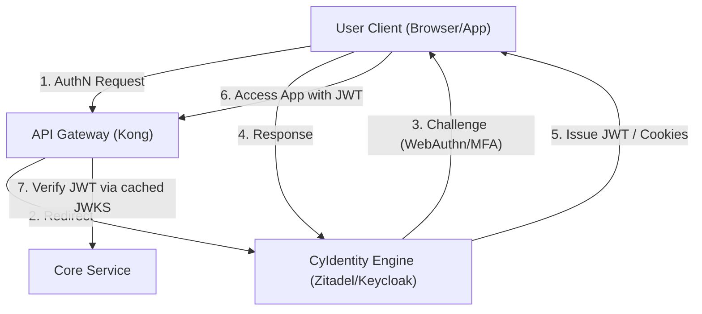

# CyIdentity Reference Architecture

## 1. System Overview

`CyIdentity` is the central Identity Provider (IdP) for the CyberCom platform. It handles identity management, multi-factor authentication (MFA/WebAuthn), federated logins, and standards-compliant OpenID Connect (OIDC) / OAuth 2.1 token issuance.

---

## 2. Realm and Tenant Layout

`CyIdentity` partitions user identities using **Realms**:
*   **`workforce` realm:** For CyberCom employees, administrators, and customer support staff. Connected to corporate Active Directories via SCIM.
*   **`customer-<tenant-id>` realms:** Isolated environments for hospital networks, corporate clients, or government offices. Supports custom SAML/OIDC federations back to hospital/client-owned directories.
*   **`citizen-<jurisdiction>` realms:** Optimized for high-volume citizen registration (`CyCitizen`), integrating national digital IDs (e.g., UAE PASS).

---

## 3. Cryptographic Token Lifecycle & JWKS

*   **Token Standards:** Access Tokens are cryptographically signed JSON Web Tokens (JWT) complying with the OAuth 2.1 and FAPI 2.0 security profiles.
*   **Signing Algorithms:** ES256 (ECDSA using P-256 and SHA-256) or RS256.
*   **Key Rotation:** Dynamic key rotation every 30 days. Active and previous signing public keys are published at the `/realms/{realm-name}/.well-known/jwks.json` endpoint.
*   **Token Expiry:**
    *   *Access Tokens:* 15 minutes.
    *   *Refresh Tokens:* 12 hours (with one-time-use rotation and replay detection).

---

## 4. WebAuthn & MFA Implementation

*   **FIDO2 / WebAuthn:** Enforced for administrative accounts, clinical providers performing e-prescribing, and financial operators.
*   **Flow:** Initiated via the browser navigator credentials API, bypassing standard username/password combinations entirely in favor of cryptographically secure passkeys.

---

## 5. Revision History

| Date | Version | Description | Author |
|---|---|---|---|
| 2026-06-21 | 1.0 | Initial CyIdentity Reference Architecture | Enterprise Architect |
