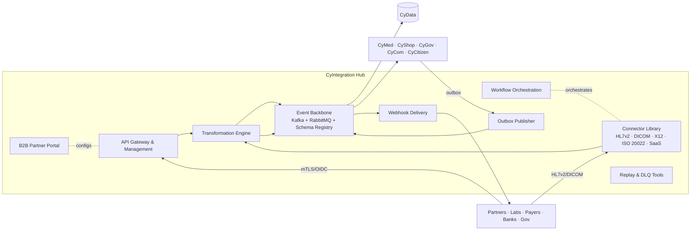

# CyIntegration Hub — Product Architecture

> **Status:** Approved — Program 1, Phase 1.1
> **Owner:** Platform Architect
> **Related:** [ADR-0003](../adr/ADR-0003-api-strategy.md), [ADR-0004](../adr/ADR-0004-event-driven-architecture-strategy.md), [ADR-0007](../adr/ADR-0007-healthcare-interoperability-strategy.md)

---

## 1. Mission

**Be the integration backbone of CyberCom** — the one place where external systems, partners, legacy protocols, and inter-product events come together, governed and observable.

## 2. Scope

**In scope**
- **API management:** publishing, discovery, rate limiting, monetization (when needed), partner onboarding.
- **Event backbone:** Kafka (events) + RabbitMQ (commands/queues) operations, schema registry, dead-letter handling.
- **ESB / iPaaS:** workflow orchestration, transformations, mediations, scheduled connectors.
- **Healthcare interop bridges:** HL7 v2 (MLLP), CDA/CCDA, DICOM/DICOMweb, X12/NCPDP — into FHIR R4 ([ADR-0007](../adr/ADR-0007-healthcare-interoperability-strategy.md)).
- **Government interop bridges:** national gov frameworks, banking (ISO 20022), tax authority connectors.
- **Webhook delivery** (signed, retry, DLQ).
- **B2B portal** for partners (credentials, configs, usage, status).

**Out of scope**
- Business logic of any product (the Hub mediates, it does not decide).
- Long-term analytical storage (events flow through to **CyData**).
- Authentication of end users (that is **CyIdentity**).
- Internal mesh traffic between two CyberCom services in the same cluster (handled by the service mesh, [ADR-0013](../adr/ADR-0013-service-mesh-strategy.md)).

## 3. Users

| User class | Examples |
|---|---|
| Internal products | CyMed, CyShop, CyGov, CyCom, CyCitizen, CyAI |
| Partners (B2B) | Labs, payers, suppliers, banks, government agencies |
| Operations | Integration engineers, SRE, on-call |

## 4. Core Modules

1. **API Gateway & Management** — north-south for partner APIs (Gateway API + management layer).
2. **Event Backbone** — Kafka clusters (event log), RabbitMQ (task queues); schema registry; tiered storage.
3. **Connector Library** — versioned connectors (HL7 v2, DICOM, X12, ISO 20022, SAP, Salesforce, common SaaS).
4. **Workflow Orchestration** — long-running flows (Temporal / Camunda / Argo Workflows — per follow-up sub-ADR), with idempotency and retry.
5. **Transformation Engine** — schema mapping, ICD-11 ⇄ ICD-10 via terminology service, deterministic field-level mappers.
6. **Webhook Delivery** — signed (HMAC), retried, DLQ, replay.
7. **Outbox Publisher** — runs alongside product DBs to publish their outbox tables reliably.
8. **B2B Partner Portal** — onboarding, credentials, configs, usage, status, runbooks.
9. **Schema Registry & Contract Catalog** — Avro/JSON-Schema, compatibility checks in CI.
10. **Replay & Recovery Tools** — replay topics from offsets/timestamps; DLQ inspector.

## 5. Shared Services Consumed

| Service | Use |
|---|---|
| CyIdentity | AuthN for partner APIs; workload identity for internal callers |
| Platform policy engine | Per-route/per-partner authorization |
| Platform secrets/KMS | Partner credentials, webhook signing secrets, mTLS certs |
| Platform audit log | Every inbound/outbound message, replay action, config change |
| Platform observability | RED + USE metrics on every connector; tracing across hops |
| CyData | Downstream sink for event log; analytics on integration health |
| CyCom | Partner status notifications |

## 6. Owned Data

- API products, plans, subscriptions, partner registrations, API keys (hashed), mTLS certs.
- Schemas (Avro / JSON-Schema) and their version history.
- Connector configurations and credentials (in Vault, referenced).
- Webhook deliveries (status, attempts, signatures) until retention expiry.
- Workflow instances and history.
- Topic configs and consumer-group offsets (operational).
- DLQ messages (retention per topic).

## 7. Consumed Data

- Product outbox tables (for transactional event publishing).
- External partner inbound payloads.
- Terminology service (ICD-11, SNOMED, LOINC) for healthcare transformations.

## 8. APIs

- **Partner-facing**: per-product OpenAPI proxies, with rate limiting, quota, usage analytics.
- **FHIR R4** REST gateway (proxying to CyMed FHIR endpoints, with auth + audit + bulk export).
- **HL7 v2 MLLP** inbound / outbound endpoints.
- **DICOMweb** (QIDO-RS, WADO-RS, STOW-RS) for imaging.
- **Admin API**: route management, partner CRUD, replay, DLQ ops.
- **Schema Registry API**.

## 9. Events

Produced (prefix `cybercom.hub.*`):

- `partner.onboarded`, `partner.suspended`
- `route.published`, `route.deprecated`
- `webhook.delivered`, `webhook.failed`, `webhook.dlq`
- `connector.error.rate.spike` (operational)

Consumed:

- Every product's outbox (via dedicated connectors) for reliable Kafka publishing.
- Partner inbound messages → translated → topic per domain.

## 10. Integrations

- **Healthcare:** HL7 v2 (Mirth-style), CDA/CCDA, DICOM/DICOMweb, FHIR R4, SMART on FHIR launch, X12 (US claims), NCPDP (pharmacy).
- **Finance / Gov:** ISO 20022, SWIFT (where applicable), national gov APIs, tax APIs, ePayments.
- **Common SaaS:** SAP, Salesforce, ServiceNow, Workday (per deployment addendum).
- **Cloud-native:** webhook providers, S3-compatible buckets, FTP/SFTP for legacy file drops.

## 11. Deployment Model

- Tier-1 service; multi-AZ default; multi-region per ADR-0008.
- Kafka and RabbitMQ managed where available; CloudNativePG-style operators on sovereign on-prem.
- Connectors deployed per-partner or per-protocol; isolated by namespace + NetworkPolicy + per-partner identities.
- Workflow engine clustered; sticky-routing avoided.
- DR: cross-region Kafka mirror; replayable from cold storage.

## 12. Security Requirements

- All partner APIs require strong authN (OAuth client credentials, mTLS, signed JWT) per partner profile.
- Per-partner rate limit + circuit breaker.
- Webhook signatures HMAC-SHA-256 with rotating shared secrets + replay protection (timestamp + nonce).
- All payloads scanned for known malicious patterns at ingress; size limits enforced.
- Topic-level ACLs (SASL/OIDC); ESO-managed credentials.
- Encryption in transit (TLS 1.3 + mTLS); at rest per [`encryption_strategy`](../security/encryption_strategy.md).
- PHI/PII flowing through the Hub never landed in operational logs; redaction at source.

## 13. Component Diagram

