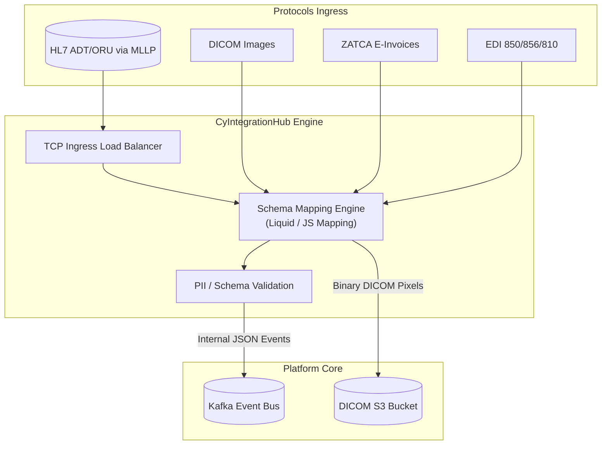

# CyIntegrationHub Reference Architecture

## 1. System Overview

`CyIntegrationHub` acts as the enterprise gateway and translator for all external network protocols, transforming healthcare-specific (HL7, FHIR, DICOM), financial (ZATCA, e-invoicing), and retail (EDI) inputs into standardized platform events.

---

## 2. Ingress Architecture & Stateful TCP Routing

Unlike HTTP protocols, HL7 v2 ADT/ORU transmissions run over persistent, raw TCP/IP sockets using the Minimal Lower Layer Protocol (MLLP):
*   **Stateful Proxying:** HAProxy or Kong Enterprise routes MLLP traffic at Layer 4. Sticky sessions map TCP connections to specific `CyIntegrationHub` pod instances to prevent socket flapping.
*   **High Availability:** Active-Passive proxy nodes with automated virtual IP (VIP) failovers (using Keepalived) prevent downtime on stateful clinic TCP feeds.

---

## 3. Schema Transformation Pipeline

1.  **Ingress Parse:** Raw message segments (e.g., HL7 pipe-delimited fields, EDI EDIFACT segments) are parsed into internal in-memory object models.
2.  **Mapping Template:** Declarative mappings (defined using Liquid or Javascript templates stored in Git) map properties to CyberCom's JSON schemas.
3.  **Audit & Queue:** The transformed entity is committed to Kafka. If an upstream target is offline, events are buffered in Kafka partitions for automatic retries.

---

## 4. Government Compliance Routers

*   **ZATCA Clearance Router:** Connects directly to the Saudi Arabia tax authority APIs. It signs invoice XMLs, computes cryptographic hashes, and clears/submits them in real-time.
*   **National Registry Connectors:** Syncs demographic data between the national citizen records and CyberCom's MPI (`Patient Master`) using secure mutual TLS (mTLS).

---

## 5. Revision History

| Date | Version | Description | Author |
|---|---|---|---|
| 2026-06-21 | 1.0 | Initial CyIntegrationHub Reference Architecture | Enterprise Architect |
