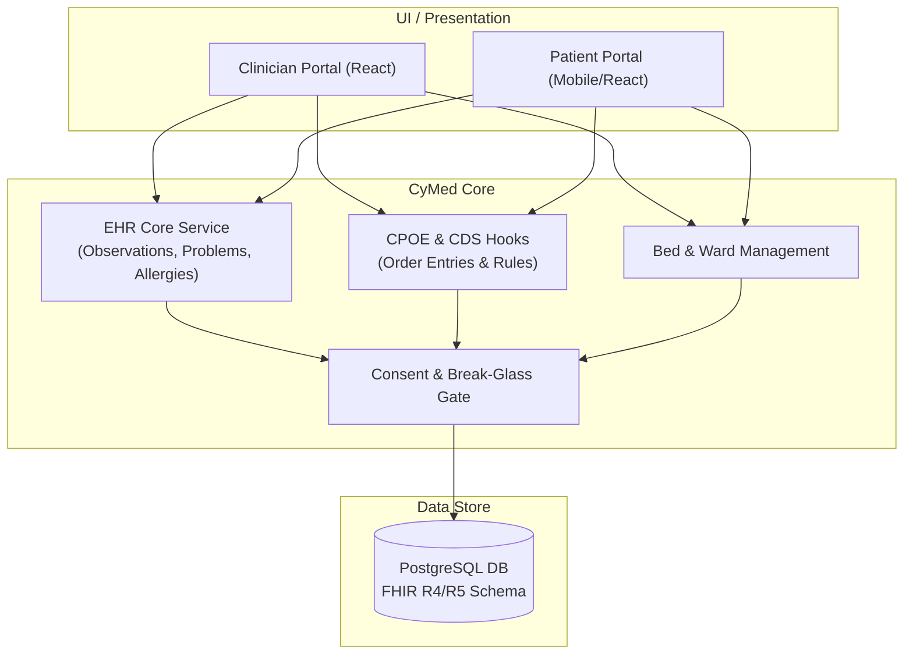

# CyMed Reference Architecture & Competitive Analysis

## 1. System Overview

`CyMed` is the core clinical, electronic health record (EHR), and hospital management system of the CyberCom Platform. It is built as a FHIR-native, microservices-based, and highly secure platform designed to meet HIPAA and JCI standards.

---

## 2. Competitive Landscape & Comparison

This section evaluates `CyMed` against major global and regional EHR competitors:

| Feature / Domain | CyMed | Epic Systems | Oracle Health (Cerner) | InterSystems TrakCare | Hakeem (Jordan) |
|---|---|---|---|---|---|
| **Architecture** | Modern Microservices, FHIR-native. | Legacy Cache/MUMPS database backend. | Monolithic relational backend migrating to OCI. | InterSystems Caché/IRIS object database. | Legacy Vista-derived monolith. |
| **Multi-Tenancy** | Native Row-Level Security (RLS) & DB pools. | Hard (requires separate virtual environments). | Hard (virtualization overlay). | Logical segregation. | No (national single-tenant instance). |
| **Customizability** | High (GitOps layout templates, open REST APIs). | High (requires proprietary Epic MUMPS programmers). | Moderate (requires proprietary tools). | Moderate (requires Cache ObjectScript). | Low (rigid national template). |
| **Data Standard** | Native FHIR R4/R5. | HL7 v2/v3 mapped to proprietary schemas. | HL7/FHIR adapters over proprietary DB. | IRIS native FHIR adapters. | Legacy HL7 mapping. |
| **Regionalization** | High (Native RTL Arabic/Eng, regional KSA/UAE cloud). | High (but expensive local installations). | High (but heavy local footprint). | Strong (TrakCare is popular in Middle East). | Single country (Jordan specific). |

---

## 3. Capability Gaps & Future Roadmap

Despite its modern microservices advantage, `CyMed` has capability gaps relative to established legacy systems:

### 3.1 Gaps Identified
*   **Specialty Modules:** Epic possesses decades of specialty workflows (e.g., *Stork* for obstetrics, *Beacon* for oncology). `CyMed` uses templated forms, which need to evolve into specialized workflow engines.
*   **Medical Device Connectivity:** Epic and Cerner have deep libraries of device-driver interfaces. `CyMed` relies on standard HL7 feeds via `CyIntegrationHub`, meaning older legacy serial-port medical devices are not natively supported.

### 3.2 Roadmap Items
1.  **Phase 1.5:** Release specialized templates for Oncology chemotherapy cycles and Neonatal ICU charting.
2.  **Phase 1.6:** Implement direct IoT-gateway integrations for major ventilator and infusion pump protocols.
3.  **Phase 1.7:** Launch regional terminology packs for local Middle Eastern dialects mapped directly to SNOMED-CT.

---

## 4. Key Architectural Subsystems

### 4.1 PHI Storage and Encryption
*   **System of Record:** `CyMed` is the source of truth for all Protected Health Information (PHI).
*   **Security:** Databases enforce row-level security. Sensitive medical elements (e.g., HIV test results, genetic files) undergo column-level encryption using unique DEKs fetched dynamically from Vault.

### 4.2 Emergency Overrides (Break Glass)
Emergency access bypasses standard ABAC rules. When activated:
1.  Access is granted for exactly 120 minutes.
2.  An audit packet is immediately signed and dispatched to the centralized audit sink.
3.  A mandatory follow-up task is assigned to the medical director’s dashboard for review within 24 hours.

---

## 5. Revision History

| Date | Version | Description | Author |
|---|---|---|---|
| 2026-06-21 | 1.0 | Initial CyMed Reference Architecture | Enterprise Architect |
