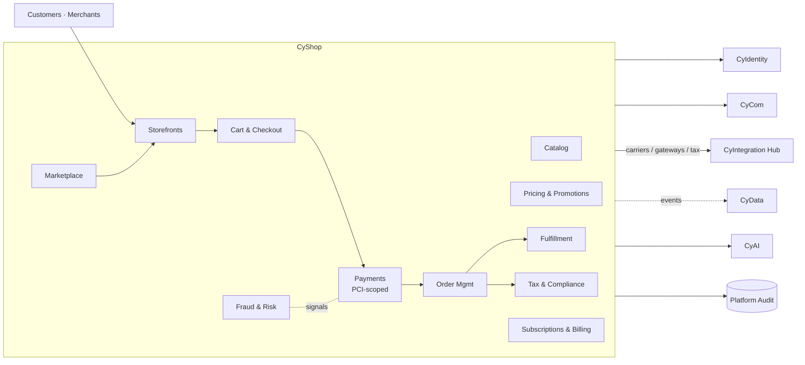

# CyShop — Product Architecture

> **Status:** Approved — Program 1, Phase 1.1
> **Owner:** Platform Architect (Commerce)

---

## 1. Mission

**Be CyberCom's commerce platform** — catalog, cart, checkout, payments (PCI scope), orders, fulfillment, marketplace, and partner storefronts — for end consumers, businesses, and public-sector storefronts.

## 2. Scope

**In scope**
- **Catalog & merchandising:** products, variants, pricing, promotions, taxes, attributes.
- **Cart & checkout:** session carts, persistent carts, address validation, shipping options.
- **Payments (PCI scope):** payment gateways, tokenization vaults, recurring billing, refunds, chargebacks.
- **Order management:** orders, fulfillment, returns, partial shipments, holds.
- **Fulfillment & logistics:** WMS integration, shipping label generation via carriers, tracking.
- **Pricing & promotion engine:** discounts, coupons, vouchers, loyalty.
- **Marketplace:** multi-seller (B2B & B2C), seller onboarding, payouts, escrow, reviews.
- **Storefronts as a service:** white-label storefront platform consumed by partners and other products (e.g. CyGov public storefronts, CyMed retail-pharmacy fulfillment).
- **Tax & compliance:** tax engine integration, invoicing, consumer-protection flows per jurisdiction.

**Out of scope**
- Identity & sign-in → **CyIdentity** (customer realms).
- Customer messaging (order updates, receipts) → **CyCom**.
- Clinical pharmacy / prescription clinical decisions → **CyMed**. CyShop handles the *fulfillment commerce* only.
- Government procurement (tendering, vendor mgmt) → **CyGov**. CyShop ≠ e-procurement.
- Analytics / margin / cohort reporting → **CyData**.

## 3. Users

| User class | Examples |
|---|---|
| Customers / shoppers | Consumers (B2C), business buyers (B2B) |
| Merchants / sellers | Marketplace sellers, brand managers |
| Storefront operators | Tenants that run CyShop-powered stores (incl. CyGov, CyMed retail) |
| Operations | Order ops, returns, fraud, customer support |
| Partners | Carriers, payment gateways, tax engines, WMS systems |

## 4. Core Modules

1. **Catalog** — products, variants, attributes, inventory references.
2. **Pricing & Promotions** — list prices, tiered pricing, discounts, coupons, taxes, loyalty.
3. **Cart & Checkout** — session/persistent carts, address, shipping option selection.
4. **Payments** — gateway abstraction (Stripe / Adyen / regional), tokenization vault, recurring billing, refunds, 3-D Secure / SCA.
5. **Order Management (OMS)** — order state machine, holds, splits, returns, RMA.
6. **Fulfillment** — WMS integration, label generation, multi-carrier shipping, tracking.
7. **Marketplace** — seller catalog, listings, payouts, escrow, KYC, reviews.
8. **Storefronts** — multi-tenant white-label storefronts; headless commerce APIs for embedded use.
9. **Tax & Compliance** — tax engine integration (Avalara/Vertex/regional), invoice generation, consumer-protection flows.
10. **Fraud & Risk** — risk scoring (vendor or rules); device fingerprinting; payment-attempt analysis.
11. **Subscriptions & Billing** — for SaaS/subscription products; integrates with CyShop payments.

## 5. Shared Services Consumed

| Service | Use |
|---|---|
| CyIdentity | Customer realm; merchant realm; SCA flows where IdP-assisted |
| CyIntegration Hub | Carriers, gateways, tax engines, WMS, ERP partners |
| CyData | Sales analytics, margin, customer cohort metrics |
| CyAI | Search, recommendations, fraud signals (model service) |
| CyCom | Order updates, receipts, abandoned-cart, marketing (consent-gated) |
| Platform audit / observability / secrets | Standard; **PCI-scoped enclave** for payment-secret handling |

## 6. Owned Data

- Catalog: products, variants, prices, promotions, taxes.
- Carts, sessions, wishlists.
- Orders, fulfillments, returns, RMAs, holds.
- Payment **tokens** (not PANs); PCI vault references; transactions; refunds; chargebacks.
- Subscriptions, plans, invoices, billing schedules.
- Marketplace: sellers, listings, payouts, escrow, reviews.
- Tax records, invoices.
- Fraud signals and risk decisions.

## 7. Consumed Data

- Customer identity + addresses + consents from **CyIdentity**.
- External: carrier rates, tax-engine results, payment-gateway responses.
- Source-of-record events from products that trigger billing (e.g. CyMed charge capture, CyGov fees, CyCom premium-traffic billing).

## 8. APIs

- **Storefront APIs** (headless): catalog, cart, checkout, account.
- **Order APIs**: create / read / update / list; webhooks for state changes.
- **Payment APIs**: tokenize, charge, refund, recurring; SCA flows.
- **Marketplace APIs**: seller CRUD, listings, payouts, reviews.
- **Admin APIs**: merchandising, pricing, promotions, tax setup, fraud rules.
- **Subscriptions API**: plans, customer subscriptions, billing events.

## 9. Events

Produced (prefix `cybercom.cyshop.*`):

- `cart.created`, `cart.abandoned`, `cart.checked_out`
- `order.placed`, `order.confirmed`, `order.cancelled`, `order.shipped`, `order.delivered`, `order.returned`
- `payment.authorized`, `payment.captured`, `payment.refunded`, `payment.failed`, `payment.chargeback`
- `subscription.created`, `subscription.renewed`, `subscription.cancelled`
- `seller.onboarded`, `seller.payout.completed`
- `fraud.flagged`

Consumed:

- `cybercom.cymed.chargecapture.posted` (hospital billing → CyShop invoice).
- `cybercom.cygov.fee.assessed` (government fee → CyShop charge).
- `cybercom.cycom.premium.usage` (premium traffic → CyShop billing).
- `cybercom.cyidentity.account.*` (customer/merchant lifecycle).

## 10. Integrations

- **Payment gateways:** Stripe, Adyen, regional (per deployment addendum).
- **Tax engines:** Avalara, Vertex, regional.
- **Carriers:** UPS, FedEx, DHL, regional postal.
- **WMS / fulfillment partners.**
- **ERP partners** (where existing ERPs run alongside CyShop) via CyIntegration Hub.
- **Marketplace KYC providers** for seller onboarding.

## 11. Deployment Model

- Tier-1 service for payments + order placement; Tier-2 for catalog / storefronts.
- Multi-AZ default; multi-region for SaaS production.
- **PCI scope minimized**: payment-secret handling isolated to a dedicated PCI enclave with stricter controls (network, audit, access).
- Per-deployment vendor addendum for payment + tax + carrier.

## 12. Security Requirements

- **PCI DSS** scope explicitly identified and minimized; tokenization at the gateway; **no PANs in our DBs**.
- Strong customer authentication (SCA) where required (PSD2, regional rules).
- All payment endpoints rate-limited and bot-defended (CAPTCHA / risk engine).
- Encryption in transit (TLS 1.3) and at rest (AES-256); KMS-managed keys; per-tenant CMK where required.
- Address and contact data treated as PII; minimization in event payloads.
- Audit every payment, refund, chargeback, seller payout, and admin change.
- Fraud signals respect privacy; no PII shared with third parties without consent.
- Tax invoices archived per jurisdictional retention.

## 13. Component Diagram

