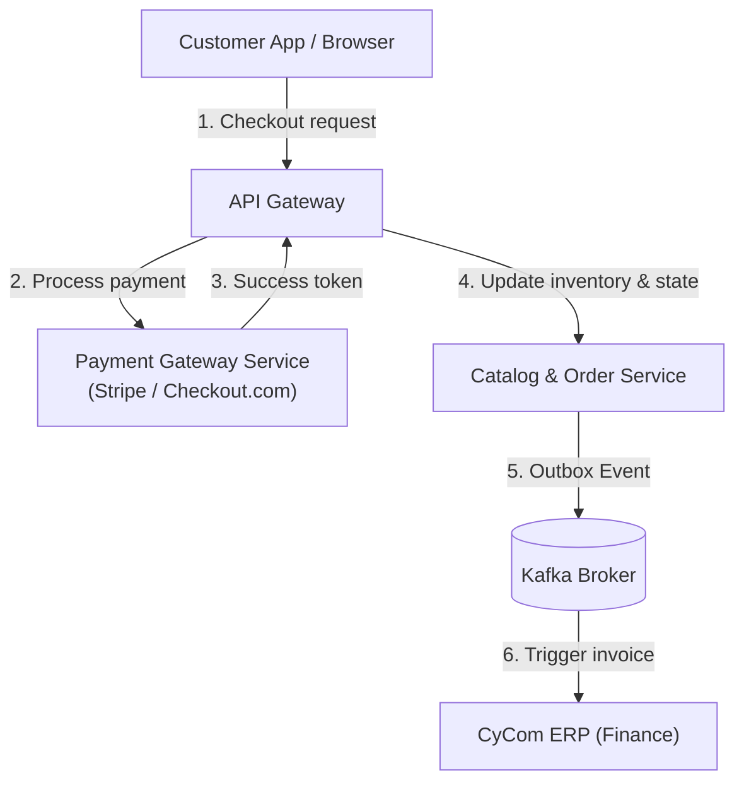

# CyShop Reference Architecture

## 1. System Overview

`CyShop` is CyberCom's e-commerce and retail transaction engine. It handles catalogs, shopping baskets, credit card processing, subscription management, and retail pharmacy fulfillment.

---

## 2. Core Modules

1.  **Catalog Service:** Manages retail products (SKUs, pricing, attributes).
2.  **Order Service:** Manages shopping baskets, order placement, state transitions (Pending ➔ Paid ➔ Shipped).
3.  **Payment Gateway Service:** Interfaces with PCI-DSS external processors (Stripe, Checkout.com, local Middle East networks like Mada, KNET, Benefit).
4.  **Fulfillment Service:** Directs warehouse packaging, labels, and tracking details.
5.  **Subscription Engine:** Manages recurring monthly billing for corporate health programs or SaaS usage tiers.

---

## 3. Data Ownership & Boundaries

*   **System of Record:** `CyShop Catalog` is the source of truth for retail items, prices, and orders.
*   **Payment Details:** Under no circumstances does `CyShop` store raw credit card numbers or CVVs. All card inputs are tokenized directly in the customer's browser via payment processor frames, and only secure tokens are saved to PostgreSQL.

---

## 4. Revision History

| Date | Version | Description | Author |
|---|---|---|---|
| 2026-06-21 | 1.0 | Initial CyShop Reference Architecture | Enterprise Architect |
