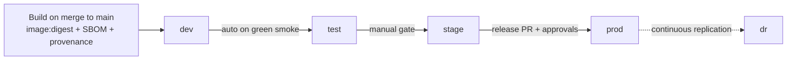

# Environment Strategy & Promotion

> **Status:** Approved — Program 0, Phase 0.5
> **Owner:** Infrastructure Architect
> **Implements:** [ADR-0012 Environment Management Strategy](../adr/ADR-0012-environment-management-strategy.md)

CyberCom uses a small, well-defined set of environments. Promotion between them is automated, gated, and auditable.

---

## 1. Environments

| Env | Purpose | Persistence | Data | Access |
|---|---|---|---|---|
| `local` | Inner dev loop | Per workstation | Synthetic / fake | Engineer |
| `ci` | Per-PR ephemeral pipeline | Per CI job | Synthetic via Testcontainers | CI runner |
| `preview` (optional) | Per-PR live preview | Per PR (TTL ≤ 72 h) | Synthetic | Engineers + designers |
| `dev` | Always-on integration | Long-lived | Synthetic, freely mutable; daily reset of volatile data | Engineering |
| `test` | Manual / exploratory QA + staging perf | Long-lived | Synthetic, controlled | QA + Engineering |
| `stage` | Pre-prod; mirrors prod topology and data shape | Long-lived | Synthetic high-fidelity (volume + distribution) | QA + Release Mgr + read-only Sec |
| `prod` | Production | Long-lived | Real tenant data | Tightly controlled; JIT for ops |
| `dr` | Disaster recovery target (warm/active) | Long-lived | Replicated from `prod` | Same as `prod` |

`infrastructure/environments/{dev,test,stage,prod}/` holds the IaC and Argo CD values per environment.

---

## 2. Topology Mirroring

- `stage` MUST mirror `prod` topology (region count, replicas baseline, service mesh, policies). Differences are documented exceptions.
- `dev` and `test` MAY simplify (single region, fewer replicas) but use the same Helm charts and Argo Applications.
- All environments share the same container images and the same Helm chart versions — only **values** differ.

---

## 3. Promotion Model

Promotion is **digest-based** — an image digest passes through environments unchanged.



- **Build → `dev`:** automatic on merge to `main` (or domain branch).
- **`dev` → `test`:** automatic after `dev` smoke + soak (≥ 30 min) is green.
- **`test` → `stage`:** **manual** promotion PR in GitOps repo; QA sign-off attached.
- **`stage` → `prod`:** release PR per [`release_management`](../governance/release_management.md); progressive delivery (canary → staged → full) with SLO-based auto-rollback.
- **`prod` → `dr`:** continuous (data) + scheduled drills (apps).

No hand-edited config in any environment. **No image is built per-environment** — same digest is promoted.

---

## 4. Environment Isolation

| Isolation | Method |
|---|---|
| **Network** | Per-environment VPC/VNet; private subnets; default-deny NetworkPolicies |
| **Identity** | Per-environment CyIdentity realm; per-env workload identities |
| **Secrets** | Per-environment Vault mount; ESO scoped per namespace |
| **Storage** | Per-environment buckets, DBs, KMS keys |
| **Cloud accounts** | Separate per env (or subscription/project); `prod` and `dr` strictest |
| **Observability** | Per-env tenancy in Prometheus/Loki/Tempo |
| **CI access** | OIDC roles per env; only release pipeline can assume `prod` |

No shared state across environments. **Cross-env reads are forbidden** except via documented sync jobs.

---

## 5. Data Strategy by Environment

| Env | Data |
|---|---|
| `local`, `ci`, `dev`, `preview`, `test`, `stage` | **Synthetic only.** No production data. PHI/PII forbidden. |
| `prod`, `dr` | Real data; full classification rules apply |

- Synthetic generation uses platform fixtures + factories.
- A documented **de-identification pipeline** MAY produce a stage-shaped dataset from prod for performance/scale testing — only with privacy sign-off and never restoring back to a lower env unchanged.

---

## 6. Provisioning

All environments are **fully IaC**:

```
infrastructure/environments/<env>/
├── README.md
├── terraform/         # Cloud + cluster + addons for this env
├── kubernetes/        # Argo Applications + Helm values per service
├── policies/          # Kyverno / OPA bundles
└── observability/     # Dashboards, alerts, SLOs per service
```

- Per-env Terraform workspace; remote state encrypted, locked, separate per env.
- Kubernetes namespaces per product/service; LimitRange + ResourceQuota mandatory.
- Argo CD ApplicationSets generate per-service Applications from a template.

---

## 7. Lifecycle Policies

| Resource | Policy |
|---|---|
| Preview env | TTL ≤ 72 h, auto-destroy on PR close |
| `dev` namespaces | Idle (> 30 d no activity) auto-cleaned |
| Snapshots | Per [`backup_recovery_strategy`](../security/backup_recovery_strategy.md) |
| Logs / metrics | Per env retention (`dev` 30 d, `prod` 90 d hot / 1 y cold) |
| Cost guardrails | Per-env budgets with alerts; PR labels show est. cost delta where possible |

---

## 8. Access Model

| Env | Workforce read | Workforce write | JIT elevation |
|---|---|---|---|
| `local`/`ci` | n/a | n/a | n/a |
| `dev` | Engineering | Engineering | n/a |
| `test` | Engineering + QA | QA + designated owners | rare |
| `stage` | Engineering + QA + SecOps | Release Manager + on-call | PAM-approved |
| `prod`/`dr` | SecOps + Compliance + on-call (read scoped) | **None standing**; deploy via pipeline only | PAM-approved + dual approval |

Every privileged access is JIT, time-boxed, recorded, and audited (see [`identity_access_strategy`](../security/identity_access_strategy.md) §6).

---

## 9. Promotion Approvals

| Promotion | Approvals |
|---|---|
| `dev` → `test` | Automatic on smoke green |
| `test` → `stage` | QA sign-off + domain owner |
| `stage` → `prod` | Release Manager + Chief Architect (+ Compliance for healthcare/government) per [`release_management`](../governance/release_management.md) §6 |
| Hotfix → `prod` | Release Manager + Chief Architect (expedited); back-merge ≤ 24 h |

---

## 10. Forbidden

- Hand-edited config in any environment outside the GitOps flow.
- Sharing credentials across environments.
- Real data in non-prod environments.
- Building per-env images.
- Promoting without a passed test gate from the source environment.
- Skipping `stage` for non-hotfix changes.
