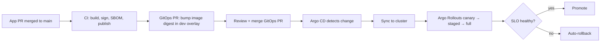

# GitOps Strategy

> **Status:** Approved — Program 0, Phase 0.5
> **Owner:** DevOps Architect
> **Implements:** [ADR-0010 GitOps Deployment Strategy](../adr/ADR-0010-gitops-deployment-strategy.md)

CyberCom uses **GitOps** as the single deployment model: the desired state of every cluster is declared in git, and a controller continuously reconciles reality to git.

---

## 1. Principles

1. **Git is the source of truth** for desired state — cluster, app, config, policy.
2. **Pull, not push.** A controller in the cluster pulls; CI never pushes to `kubectl`.
3. **Declarative, not imperative.** Every change is a diff in git.
4. **Continuous reconciliation.** Drift is detected and corrected automatically.
5. **Auditable & reversible.** Rollback = revert a commit.

---

## 2. Tooling

- **Argo CD** is the GitOps controller (Flux as fallback if regional cloud restricts Argo).
- **Argo Rollouts** (or Flagger) for progressive delivery (canary / blue-green).
- **Helm** for templating; **Kustomize** overlays for environment differences.
- **Kyverno** (or OPA Gatekeeper) for admission policy: signature verification, baseline security, image registry allowlist.
- **External Secrets Operator** for secret materialization from Vault.
- **cert-manager** for certificate lifecycle.

---

## 3. Repository Layout

Two-repo pattern (preferred):

- **App repos** (this monorepo + future product repos) — code, Dockerfile, Helm chart, OpenAPI, tests.
- **GitOps repo** (`infrastructure/gitops/` in this repo, or a dedicated repo later) — declared state for each environment.

Structure inside `infrastructure/gitops/`:

```
gitops/
├── README.md
├── apps/
│   └── <service>/
│       ├── base/                  # Common manifests / Helm values
│       └── overlays/
│           ├── dev/
│           ├── test/
│           ├── stage/
│           └── prod/
├── platform/                       # Cluster addons (ingress, mesh, observability, ESO, cert-manager)
│   ├── base/
│   └── overlays/<env>/
├── policies/                       # Kyverno / OPA bundles per env
└── argocd/
    ├── projects/                   # Argo Projects per product/team
    └── applicationsets/            # Generators for per-service Applications
```

---

## 4. App Reconciliation Flow



- **Digest-pinned** image references — no `latest`, no tag floats.
- Image bump is an automated PR opened by CI.
- Promotion to `test`/`stage`/`prod` is a PR moving the digest between overlays — see [`environment_strategy`](environment_strategy.md).

---

## 5. Branching in GitOps

- One branch (`main`) on the GitOps repo.
- Environments are separated by **folders/overlays**, not branches.
- Promotion = PR that copies a digest forward.
- Hotfixes = same flow with expedited approvals.

---

## 6. Sync & Health

- Argo CD `automated.selfHeal=true` for `dev`/`test`; manual sync window for `prod` releases.
- Sync waves enforce ordering (CRDs → operators → addons → apps).
- Health checks: app `readyz`, Rollouts analysis on SLIs, custom Lua health for stateful operators.
- Sync failures alarm Platform on-call.

---

## 7. Progressive Delivery

- **Canary** (5% traffic) → bake (5–15 min) → **staged** (25/50%) → **100%** with auto-rollback on:
  - Error rate exceeds baseline.
  - p95 latency exceeds budget.
  - Custom analysis metrics (per service).
- Strategy configurable per service in Helm values; defaults per tier.
- Database migrations applied as pre-sync hooks with safe-migration patterns (see [`database_standards`](../standards/database_standards.md) §9).

---

## 8. Admission & Supply Chain

- Kyverno/Connaisseur policies block:
  - Unsigned images.
  - Images outside the allowed registries.
  - Pods running as root, privileged, hostNetwork.
  - Missing required labels.
- All admission decisions logged; denial spikes alert SecOps.

---

## 9. Secrets in GitOps

- Only **references** to secrets in git (ExternalSecret resources / SealedSecrets if used).
- Materialized secrets stay inside the cluster, mounted as files.
- Rotation flows from Vault → ESO refresh → app reload, with no GitOps PR required.

---

## 10. Rollback

- Any change can be rolled back by reverting the GitOps PR.
- Argo CD revision history preserved; `argocd app rollback` available for emergencies (audited).
- For DB-impacting changes, rollback follows the migration plan in the release PR.

---

## 11. Multi-Cluster

- Argo CD control plane manages many clusters (per env, per region, per tenant tier).
- ApplicationSets generate per-cluster Applications from a single template.
- Cluster registration is itself GitOps (declarative `Cluster` secrets via ESO).

---

## 12. Forbidden

- `kubectl apply` to `stage`/`prod` (except documented break-glass).
- Image tags that float (`latest`, branch names).
- Per-environment branches in the GitOps repo.
- Plaintext secrets in any git history.
- Manual edits to live cluster state (auto-reverted by reconciliation; audited).
