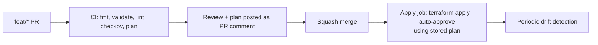

# Terraform Strategy

> **Status:** Approved — Program 0, Phase 0.5
> **Owner:** Infrastructure Architect

All cloud and platform infrastructure is provisioned with **Terraform**. No click-ops in any non-trivial environment.

---

## 1. Principles

1. **Infrastructure as Code is law.** Every resource that survives a reboot is in Terraform.
2. **Modules over copies.** Reusable, versioned modules in `infrastructure/terraform/modules/`.
3. **Workspaces per environment, never per engineer.**
4. **Remote state, locked, encrypted.**
5. **OIDC, not keys.** CI/CD assumes short-lived cloud roles via OIDC.
6. **Plan, review, apply.** Apply only from CI, on a merged change, with a stored plan.

---

## 2. Layout

```
infrastructure/terraform/
├── README.md
├── bootstrap/                 # One-time: state backends, OIDC trust, KMS roots
├── modules/                   # Reusable modules (per cloud + cross-cloud)
│   ├── network/
│   ├── kubernetes-cluster/
│   ├── postgres/
│   ├── object-storage/
│   ├── kms/
│   ├── observability/
│   └── ...
├── github/                    # GitHub org/repos/branch protection/teams
└── envs/                      # Per-environment root configurations
    ├── dev/
    ├── test/
    ├── stage/
    └── prod/
```

`infrastructure/environments/<env>/terraform/` (per [`environment_strategy`](environment_strategy.md)) MAY consume modules from here or compose root configs from `envs/<env>/`. The duplication is intentional: env folders own product-aware composition; `terraform/` owns reusable building blocks.

---

## 3. Versioning

- Terraform >= 1.7 (track latest stable; pin via `required_version`).
- Providers pinned to exact minor in `required_providers`.
- Modules versioned with semver; consumed via Git tags (`source = "git::...//modules/postgres?ref=v1.4.0"`) or a private module registry.

---

## 4. State

- Backend: cloud object storage with versioning + encryption + lock table.
  - AWS: S3 + DynamoDB lock.
  - Azure: Storage Account + blob lease.
  - GCP: GCS + state lock.
- One **state file per environment per cloud account**.
- State **never** committed to git.
- State KMS keys distinct per env; backups follow [`backup_recovery_strategy`](../security/backup_recovery_strategy.md).
- State access via OIDC role; human read access via PAM (JIT).

---

## 5. Authentication

- CI/CD: **GitHub Actions OIDC → cloud role** (no long-lived keys).
- Humans: SSO via CyIdentity → assume read-only by default; JIT elevation for write.
- Bootstrap (one-time): performed under tightly controlled break-glass with full audit; output stored as reference, never re-applied without ADR.

---

## 6. Module Standards

- Each module has `README.md`, `variables.tf`, `outputs.tf`, `versions.tf`, `examples/`.
- Tags applied to every resource: `cybercom:product`, `cybercom:service`, `cybercom:env`, `cybercom:owner`, `cybercom:tier`, `cybercom:cost_center`, `cybercom:data_class`.
- Sensible secure defaults: encryption on, public access off, logging on, deletion protection on (for stateful).
- No hard-coded names; namespacing via input.
- Tested with `terraform validate` + `tflint` + `checkov` in CI; integration tests via Terratest for stable modules.

---

## 7. Change Workflow



- `terraform plan` runs on every PR; output posted as a PR comment.
- Plan must be approved by CODEOWNERS; security-impacting changes need Security Architect.
- `apply` runs only from `main` (or the env-promotion branch) on merged changes.
- For `prod`, an additional manual approval gate is enforced (GitHub Environments + required reviewers).

---

## 8. Drift Detection

- Nightly `terraform plan` per env; non-empty diff opens an issue + alerts.
- Out-of-band changes are rolled back to declared state or codified via PR.

---

## 9. Secrets in Terraform

- **Never** in `.tfvars` committed to repo.
- Pulled from Vault / cloud secret manager at apply time via the appropriate provider.
- Outputs containing secrets marked `sensitive = true`; redacted in logs and plan output.
- For bootstrap roots (KMS, OIDC), seed values come from PAM-approved break-glass, then rotated.

---

## 10. Cost & Sustainability

- Cost tags mandatory.
- `infracost` runs in CI; significant deltas surfaced on PR.
- Per-env budgets + alerts; quarterly review by Platform Lead.

---

## 11. Forbidden

- Click-ops in any environment beyond `local`.
- Storing state on a laptop or in git.
- Long-lived cloud access keys in CI or repo secrets.
- Using `terraform apply` from a developer machine against `stage`/`prod`.
- Pinning providers to `~> X` without an upper bound.
- Module changes without bumping the module version tag.
